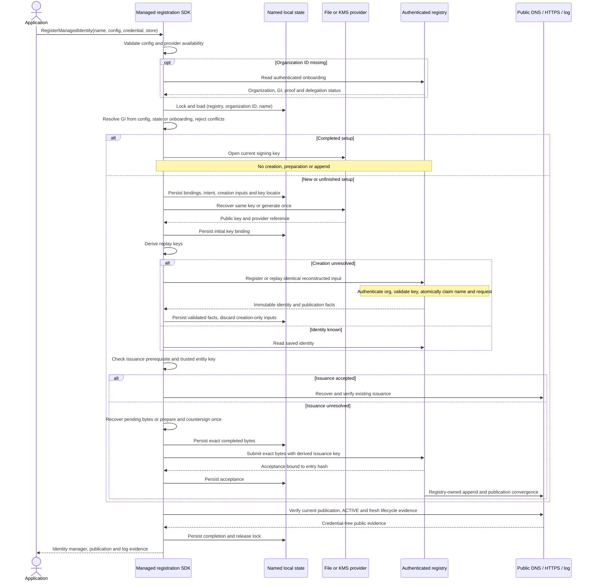

# Managed Registration Server Requirements

Outstanding server work for [managed setup](sdk-design/13-managed-registration.md)
and the [registry contract](sdk-design/05-transport-and-registry.md#named-managed-registration).
All SR items remain open until real persistence/integration tests pass. Observations
refer to `~/dnsid` revision `95c68f3e`, not deployed availability. The Known Foundry
PRD informs product requirements; its Working Notes are excluded.

## Workflow Overview

The SDK call blocks through public verification; it is not the PRD's separate
`create()` / `active()` API. This diagram shows intended behavior, not current coverage.

On timeout, retain progress and return a resumable error. Unknown creation replays
identical input; unknown submission retries exact bytes. Replacement is a separate,
fresh-key operation after confirmed terminal state, not a timeout fallback.

## Existing Account Binding Discovery

`GET /api/v1/org` returns internal organization UUID `id`.
`GET /api/v1/org/onboarding` returns organization/GI and proof/delegation status;
[05](sdk-design/05-transport-and-registry.md#account-binding-discovery) defines validation.
It does not return a complete entity JWKS URL, so `entityKeyUrl` stays configured.
No new discovery endpoint is needed.

API-key middleware supplies organization-admin context before session checks,
allowing the admin-only onboarding read. Production assembly wires the service;
unconfigured onboarding returns 503. Source checks covered `server.go`,
`middleware.go`, `apikey_handlers.go`, `organization_handler.go`,
`org_onboarding_handler.go`, and `internal/serverapp/build.go`. Focused organization/
onboarding tests passed; API-key admission was source-checked, not tested live.

## Required Server Work

| ID | Requirement | Observed gap / entry points |
|---|---|---|
| SR-1 | Validate derived key against authenticated organization/name/public-key thumbprint before allocation; reject mismatch without disclosure. | `AuthContext.OrgID` and onboarding bindings exist; `handleCreateAgent` accepts arbitrary keys. |
| SR-2 | Require normalized named-setup handle; one nonterminal identity per organization/name, including pending creation. | Name is optional metadata; `Agent.Indexes` lacks organization/name uniqueness. |
| SR-3 | Matching name/key/input opens the same identity; conflicts do not mutate/allocate. Authorized rotation preserves identity without another issuance. | `replayCreateAgent` opens by request key, not name; `CheckKeyUniqueness` may return conflict rather than open. |
| SR-4 | Claim name/key, request fingerprint, and identity atomically; no success without durable claims or losing allocations. | Agent creation precedes `idempotency.Store`; losers are cancelled and some store failures only logged. |
| SR-5 | Permanent organization-scoped replay bindings/tombstones, including terminal/deleted identities. | `PGIdempotencyStore` uses a 24-hour TTL, reclaims/removes expired rows, and deletes some rollback claims. |
| SR-6 | Explicit fresh-key replacement with new ID/domain/stream, atomic name reassignment, and preserved history. Reject all previous initial/rotated keys; old replay takes precedence. | No named replacement mapping; active-key uniqueness does not enforce historical non-reuse. |
| SR-7 | Recover interrupted workflow handoff without reallocation or stranded identities. | Creation-to-Temporal crash gap relies on provisioning cleanup timeout. |
| SR-8 | Matching replicas converge on one ISSUANCE; completed opens recover evidence without preparation/append. | Integrate existing prepare/submit handlers and `RegistrationWorkflow` with named opening and recovery; no second append path. |
| SR-9 | Implement [key-specific endpoints](#key-specific-operational-endpoints-sr-9). | PRD (3), Journey 2/custody requirement; routing, rotation publication, and caches not yet reviewed. |

### Key-Specific Operational Endpoints (SR-9)

Foundry serves `https://<agent-domain>/.well-known/<RFC7638-thumbprint>-jwks.json`:

- Permanently bind each URL to one public signing key; never redirect/rebind/reuse
  it or expose private material. Return the URL in publication configuration and
  publish it as entity-signed TXT `ku`.
- Rotation publishes the distinct new URL and updated entity-signed TXT through
  the existing coordinator. The current JWKS contains only the current key.
- Retain the old URL/key for a configured bounded interval after TXT publication.
  Origin/CDN cache lifetimes must not extend availability beyond that interval;
  the PRD does not specify its duration.
- Retention does not extend signing authority or replace historical log evidence.
  Signing resumes only after new publication and accepted rotation continuity are
  verified. Fresh verification follows signed current `ku`, never old-URL fallback.

This is a product path/retention convention, not a DNSid protocol rule. SDKs consume
returned/signed URLs rather than construct them.

## Acceptance Checks

Use real PostgreSQL and shipped server assembly, including workflow handoff.
In-memory handler tests alone cannot establish atomic/permanent recovery.

- [ ] SR-1: API-key onboarding is tenant-isolated with accurate readiness status;
  wrong configured organization fails before identity, billing, or workflow writes.
- [ ] SR-2/SR-3: repeated/independent matching hosts open one identity; other tenants
  are isolated; conflicting key/input does not mutate it.
- [ ] SR-4: concurrent creates produce one registration, no cancelled losers;
  claim-storage failure cannot return success.
- [ ] SR-5: restart, elapsed time beyond 24 hours, lost response, terminal state,
  and deletion never expire/reassign the original request key.
- [ ] SR-6: replacement has fresh ID/domain/stream and terminal old history;
  previous initial/rotated keys fail and delayed old requests cannot affect it.
- [ ] SR-7: interruption around claim commit/Temporal handoff resumes the original
  operation without orphan or duplicate allocation.
- [ ] SR-8: replicas produce one ISSUANCE; restart/authorized rotation opens the
  completed identity without another preparation/append.
- [ ] SR-9: creation/rotation return and publish distinct, valid-TLS URLs with one
  bound key each; updated TXT is entity-signed and log continuity verified.
- [ ] SR-9: interrupted rotation resumes the same operation/URLs; signing stays
  paused until publication and accepted evidence converge.
- [ ] SR-9: old-URL/cache expiry obeys retention; no redirect, rebinding, unexplained
  current-key change, or verification fallback.

## Other PRD Differences, Not Changed by Named Registration

These separate product requirements remain unresolved:

- Foundry requires verified customer-domain onboarding and customer-accountable GI/
  entity custody even on registry-operated domains; current sandbox behavior differs.
- Foundry allocates prepared dedicated `.io` domains; ordinary registration currently
  allocates root subdomains, while Live provisioning is a separate workflow.
- PRD `create()` / `active()` separates progress from completion; SDK setup still blocks
  through public verification.
