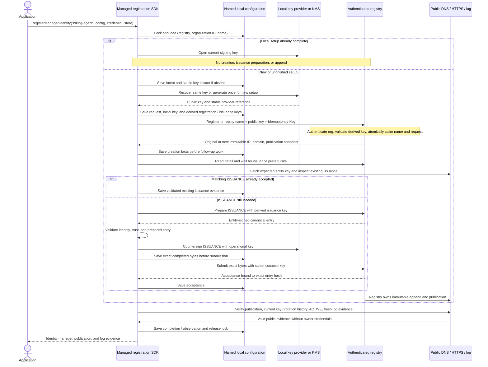

# Managed Registration Server Requirements

This tracks server work needed by the named SDK workflow in
[sdk-design/13](sdk-design/13-managed-registration.md) and the registry contract in
[sdk-design/05](sdk-design/05-transport-and-registry.md#named-managed-registration).
It is a requirements tracker, not a claim that the hosted service implements this
contract. The Known Foundry PRD's main journeys inform the named-agent behavior;
its Working Notes are excluded.

## Registration Contract

- Configuration supplies the stable registry organization ID with the credential.
  Organization ID identifies the account; governance ID is its verified domain.
  They are not interchangeable. The credential authenticates the organization.
- The SDK selects local state by registry/organization/name, sends that same name
  as display metadata, and derives its request key from organization/name/initial
  public-key thumbprint. The exact derivation is in 13.
- The server enforces organization-scoped name uniqueness and permanent creation
  replay. Matching hosts converge on one identity; conflicting keys fail.
- Revoked or retired names can point to a replacement only through a new operation
  with a fresh key. Old request keys still identify the old operation.
- Ordinary HTTP deadlines and cancellation remain. No recovery adapter,
  replay-expiration clock, or `--server-contract-verified` flag proves support.

## Workflow Overview

This is the intended workflow, not a claim of current server support. The
requirements below track the implementation work. The SDK call is
`RegisterManagedIdentity`, not the PRD's separate `create()` / `active()` API.

- A timeout does not mean creation failed. Save known progress, release the lock,
  and return a resumable error. A subsequent call loads this same named state;
  unknown creation retries use the saved request/key, and unknown issuance
  submission retries use the saved exact bytes/key.
- Different organizations with the same name have separate state and server name
  claims. Different unrotated keys for one occupied organization/name fail.
- Replacement is explicit: first confirm revocation/retirement, preserve the old
  state, and select a fresh key. The same name then has a new request key,
  immutable identity, domain, and stream; an old request replay stays old.
- Private operational keys stay in the local key provider or KMS. Recovery
  configuration contains references and public bindings, never private material
  or credentials. All calls have a bounded deadline and cancellation budget.

## Required Server Work

All items remain open until implementation and real persistence tests establish
the acceptance checks. Source observations below refer to `~/dnsid` commit
`95c68f3e`; recheck them before closing an item.

| ID | Requirement | Observed server behavior / entry points |
|---|---|---|
| SR-1 | Validate named request-key derivation using the authenticated organization ID, normalized name, and submitted public-key thumbprint before allocation. Reject mismatched configured organization/credential without disclosure. Expose the stable organization ID in account/API-key setup so users can configure it; no new lookup callback is needed. | API-key middleware already sets `AuthContext.OrgID`. `handleCreateAgent` accepts caller-selected keys and does not validate the named derivation. Check the onboarding response/UI for organization-ID availability. |
| SR-2 | Require a nonempty name for named managed creation, use it as display name, and enforce one nonterminal identity per organization/name. Match SDK trimming, case sensitivity, and 255-code-point bound. Same names in different organizations are independent. Unnamed low-level registration remains separate. | `CreateAgentRequest.Name` is optional metadata. `Agent.Indexes` has domain/key constraints, not an organization/name constraint. |
| SR-3 | Create-or-open: matching name/key and complete input return the same immutable identity. Different unrotated key or conflicting input fails without mutation or allocation. Opening after an authorized rotation retains the existing identity and does not issue again. | `replayCreateAgent` opens by stored request key. Name is only part of `createAgentFingerprint`; there is no named create-or-open operation. `CheckKeyUniqueness` can return a conflict instead of opening the existing identity. |
| SR-4 | Atomically claim creation and organization/name before allocating an identity. Persist the claim, request fingerprint, and registration together. Concurrent matching requests converge without cancelled losing allocations. Storage failure must not return success without the claim. | `handleCreateAgent` creates the agent before `idempotency.Store`, cancels losing allocations, and logs other store failures while continuing. Agent and local audit event are transactional, but the idempotency claim is separate. |
| SR-5 | Permanently retain organization-scoped request bindings or tombstones through restarts, inactivity, terminal state, and deletion. Old request keys never allocate replacements. | `PGIdempotencyStore.Check` excludes expired entries; `Store` assigns a 24-hour TTL and reclaims expired rows; `DeleteExpired` removes them. Rollback paths also delete entries. |
| SR-6 | Explicit replacement after revocation/retirement: fresh operational key, new immutable ID/domain/log stream, atomic name reassignment, and preserved terminal history. Reject reuse of any initial or rotated key of the previous identity. Old delayed requests must not change the current name holder. | Revoke/retire and immutable agent IDs exist, but there is no named replacement mapping. Active-key uniqueness alone does not enforce historical key non-reuse. |
| SR-7 | Recover workflow handoff after interruption so the same creation progresses without reallocation. A replay must not strand an identity whose worker was never started. | `handleCreateAgent` documents a crash gap between agent creation and Temporal start. Its stated recovery is the provisioning cleanup timeout, not resumable handoff. |
| SR-8 | Independent replicas must converge on one ISSUANCE using the SDK's derived issuance key. Opening a completed identity must not require another preparation or append. Preserve exact-byte submission and public readiness checks. | `handlePrepareTLogIssuance`, `handleSubmitTLogEvent`, and `RegistrationWorkflow` provide the existing issuance path. Verify integration with named opening, replica concurrency, and recovery; do not add a second append path. |
| SR-9 | Serve each operational key at a distinct HTTPS URL on the identity FQDN: `https://<agent-domain>/.well-known/<key-thumbprint>-jwks.json`, using its RFC 7638 thumbprint. Bind that URL permanently to that public key, return it in publication configuration, and publish it as signed TXT `ku`. On rotation publish the new key URL and entity-signed TXT under the existing rotation coordinator; retain the old key URL for a configured bounded interval after TXT publication. Each endpoint serves one public signing key, never both keys or private material. | PRD (3), Journey 2 and custody boundaries. New requirement; current server endpoint routing, rotation publication, and cache behavior have not been reviewed for this contract. |

### Key-Specific Operational Endpoints (SR-9)

The path convention is a Foundry hosting requirement, not a DNSid protocol rule.
The SDK consumes the returned URL and verifies the signed current `ku`; it does
not construct URLs from key IDs, provider aliases, or the registration name.

The old URL remains bound to the old public key during the retention interval.
Never redirect it to the new key, overwrite its JWK with the new key, or later
reuse the URL for another key. After the interval, the endpoint may become
unavailable; origin/CDN cache lifetimes must not extend endpoint availability
past the configured hosting retention interval. Retention duration is server configuration; the PRD leaves the
number of minutes unspecified.

This is an overlap of distinct URLs, not an old/new key set at the current `ku`.
The freshly verified signed TXT selects only the new URL after publication.
Keeping the old URL available does not extend old-key signing authority, bypass
rotation continuity checks, or replace historical public-key evidence in the log.
Application signing stays paused until the rotation's accepted log entry and
new publication have been verified; registry publication alone is not completion.

## Acceptance Checks

Run these against real PostgreSQL and the shipped server assembly, with workflow
handoff exercised where applicable. In-memory handler tests alone do not prove
permanent or atomic recovery.

- [ ] SR-1: onboarding provides the stable organization ID; wrong configured ID
  with a valid credential fails before any identity, billing, or workflow write.
- [ ] SR-2/SR-3: same organization/name/key/input returns the same identity on
  repeated calls and independent hosts; the same name in another organization
  remains isolated. A different unrotated key or conflicting input fails.
- [ ] SR-4: concurrent matching creates produce one immutable registration and no
  cancelled losing registrations; claim-storage failure produces no false success.
- [ ] SR-5: restart, simulated elapsed time beyond 24 hours, lost success response,
  terminal state, and deletion do not expire or reassign the original request key.
- [ ] SR-6: fresh-key replacement reuses the name but has a new ID/domain/stream;
  old history remains terminal. Initial and rotated old keys are rejected, and
  delayed old requests cannot affect the replacement.
- [ ] SR-7: interrupt before/after claim commit and Temporal handoff, then replay;
  the original operation resumes with no orphan or duplicate allocation.
- [ ] SR-8: matching replicas produce one ISSUANCE; restart and authorized rotation
  open the same completed identity without another preparation or append.
- [ ] SR-9: creation returns and publishes the initial key-specific `ku`; HTTPS
  serves exactly its one public signing key with valid TLS for the identity FQDN.
- [ ] SR-9: rotation publishes a distinct new key URL and valid entity-signed TXT;
  its accepted log entry establishes continuity. The old URL still serves only
  the old key during the configured interval, with no redirect or key rebinding.
- [ ] SR-9: interrupted rotation resumes the same operation and key URLs. SDK
  signing resumes only after accepted log evidence and new publication converge.
- [ ] SR-9: old-URL retention and origin/CDN cache expiry obey the configured
  interval. Fresh verification follows the new signed `ku`, rejects unexplained
  changes, and never falls back to the retained old URL as the current key.

## Other PRD Differences, Not Changed by Named Registration

These are separate product requirements, not prerequisites to redefine generic
DNSid verification or low-level registration:

- Verified customer-domain onboarding gates all Foundry creation; customer GI and
  customer-held-account entity custody apply even to registry-operated domains.
  Current sandbox and system-accountability behavior is different.
- Foundry assigns prepared dedicated `.io` domains. Current ordinary registration
  selects subdomains under configured roots; Live registrar provisioning is a
  separate workflow, not the PRD's warmed-pool ordinary-create path.
- PRD `create()` returns progress and `active()` waits separately. SDK design 13
  still defines a blocking registration-and-public-verification workflow.

Do not mark these differences resolved merely because named state and deterministic
request keys have been implemented.
